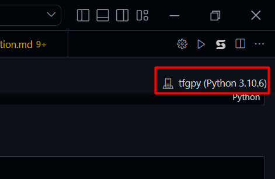
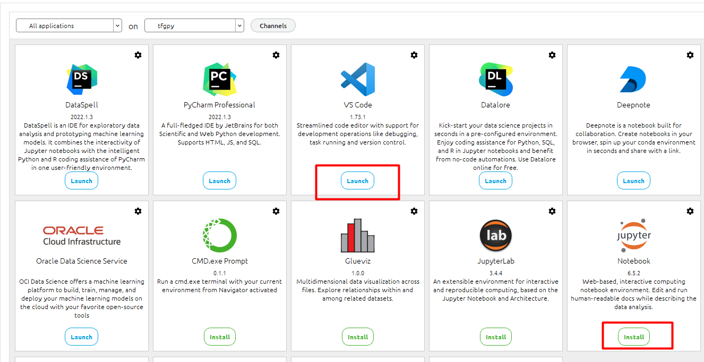

## table of contents
- [TensorFlow GPU Installation](#tensorflow-gpu-installation)
  - [installation for windows](#installation-for-windows)
  - [Set up the environment](#set-up-the-environment)
- [PyTorch GPU installation](#pytorch-gpu-installation)
  - [Installation for windows](#installation-for-windows-1)

# TensorFlow GPU Installation
## installation for windows

[pip_install](https://www.tensorflow.org/install/pip)

1- install [anaconda](https://docs.anaconda.com/anaconda/install/windows/) 

2-open anaconda prompt, use conda's prompt as it directly  points towards the base environment of conda 

3- create your own Environment run the following command

```bash
conda create --name tfgpu python=3.10
conda activate tfgpu 
```
4- installing cudatoolkit package, this will take time depending on you connection speed


```bash
conda install -c conda-forge cudatoolkit=11.2 cudnn=8.1.0
```
you can install another version of CUDA but it has to be compatible with CUDNN

5- install tensorflow 

```bash 
python -m pip install tensorflow==2.10
```

6- make sure it's running 
```bash 
python -c "import tensorflow as tf; print(tf.config.list_physical_devices('GPU'))"
```
if it worked properly you should see something like this 
```bash 
[PhysicalDevice(name='/physical_device:GPU:0', device_type='GPU')]
```
if it installed CPU version of tensorflow you should see something like this 
```bash 
[]
```

7- install all the packages needed inside tools.yml 
 > you can edit the file at your own prefrence
move tools.yml to the root directory of your conda environment 
for example 
> C:\Users\DELL>
```bash 
conda activate tfgpu
conda env update --file tools.yml
```

## Set up the environment 
for VSCODE 
- change kernel to environment kernel [tfgpu python3.10.8] 
- 
- it will ask for ipython and other dependencies, just allow all their installation and you're ready to go 
- in case if you want to to install other libraraies
  
```bash
conda activate tfgpu
pip install <package>

```

for jupyter 
- install jupyter from Anaconda Navigator 
- 
- load ipython kernel and you're ready to go 
- to install package just do it normally in a cell while tfpgu kernel is running
```bash
pip install <package>
```

# PyTorch GPU installation
## Installation for windows 

> Keep in mind that this PyTorch version is only compatible with python 3.7 to 3.9


1.  Considering that you have installed Conda already
2. run the conda prompt and the write the follwoing commands 
3. create different environment for pytorch and activate it
```bash
conda create -n torch python=3.8
conda activate torch
```
4. install pytorch using conda, this will take time depending on your connection speed
```bash
conda install pytorch==1.12.1 torchvision==0.13.1 torchaudio==0.12.1 cudatoolkit=11.3 -c pytorch
```
5. now your enviroment is ready to use pytorch, just make sure to select the environment kernel in your IDE
6. run the following command to ensure that GPU(cuda) is working 
```python
import torch 
torch.cuda.is_available() # true 
torch.cuda.device_count() #1 
torch.cuda.get_device_name(device='cuda') # GPU device name
```
7. you should see the commented output if everything is working fine
8. install your favorite packages using pip 
```bash
pip install <package>
```
9. you can also install packages using conda install but i don't recoomend that 
10. you can have both Tensorflow and pytorch on the same environment following the torch installation steps and adding this line below
```bash
pip install tensorflow==2.10
```